# AI Diagram and Visualization Generation: Best Practices Research Report

**Date:** 2025-12-29
**Purpose:** Comprehensive research on prompt engineering for diagram generation
**Scope:** Mermaid, PlantUML, architecture diagrams, flowcharts, and technical visualizations

---

## Executive Summary

This report synthesizes best practices for AI-assisted diagram generation based on established prompt engineering principles, diagram tool documentation, and visualization research. The findings provide actionable recommendations for improving diagram-focused agent system prompts.

**Key Findings:**
1. Structured output formats dramatically improve diagram quality
2. Context-aware diagram type selection is critical
3. Iterative refinement produces better results than single-shot generation
4. Syntax validation should be built into the generation process
5. Visual hierarchy and layout considerations must be explicit in prompts

---

## Part 1: Diagram Tool Syntax and Capabilities

### 1.1 Mermaid Diagram Types and Syntax

Mermaid is the recommended tool due to its:
- Native GitHub/GitLab rendering support
- Simple text-based syntax
- Wide diagram type coverage
- Active development and community

**Supported Diagram Types:**

| Type | Syntax Keyword | Best For |
|------|---------------|----------|
| Flowchart | `flowchart` | Process flows, decision trees |
| Sequence | `sequenceDiagram` | API interactions, message flows |
| Class | `classDiagram` | OOP structure, relationships |
| State | `stateDiagram-v2` | State machines, lifecycles |
| ER | `erDiagram` | Database schema |
| Gantt | `gantt` | Project timelines |
| Pie | `pie` | Data distribution |
| Git Graph | `gitGraph` | Branch visualization |
| Mindmap | `mindmap` | Concept relationships |
| Timeline | `timeline` | Chronological events |
| Quadrant | `quadrantChart` | Priority matrices |
| C4 | `C4Context` | Architecture views |

**Mermaid Syntax Best Practices:**

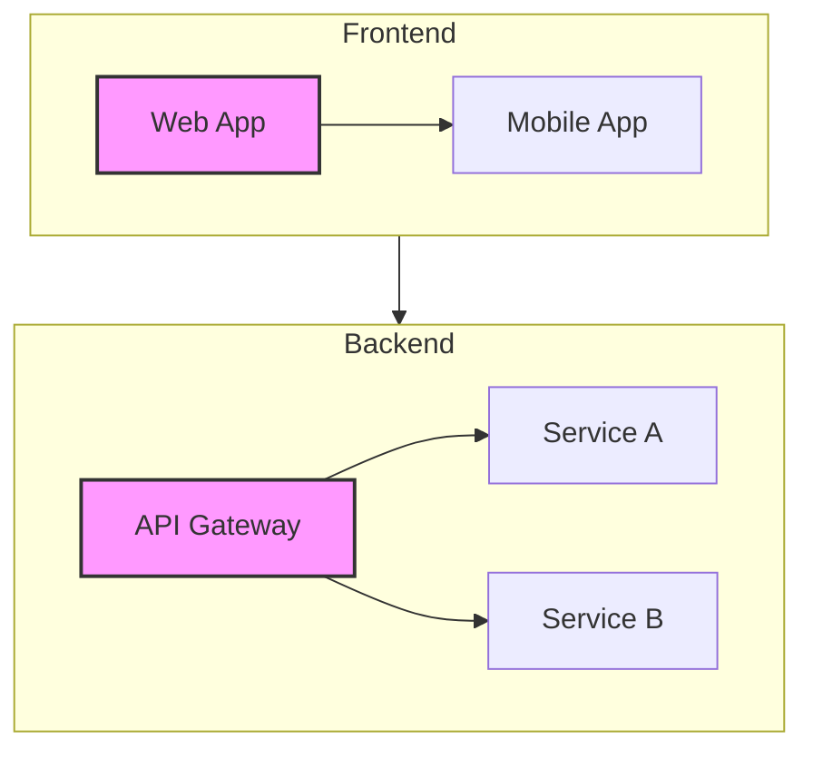

### 1.2 PlantUML Capabilities

PlantUML offers more advanced features but requires server-side rendering:

**Strengths over Mermaid:**
- More detailed sequence diagrams
- Better component/deployment diagrams
- Advanced styling options
- Preprocessing capabilities

**PlantUML Syntax Example:**
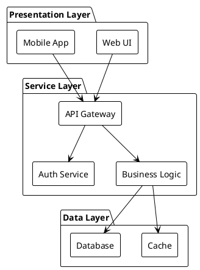

### 1.3 Diagram Type Selection Matrix

| Use Case | Recommended Type | Why |
|----------|-----------------|-----|
| API call flow | Sequence Diagram | Shows temporal ordering |
| System overview | C4 Context/Container | Standardized architecture |
| Decision process | Flowchart | Clear branching logic |
| Object relationships | Class Diagram | Shows inheritance, associations |
| Database schema | ER Diagram | Entity relationships |
| State transitions | State Diagram | Finite state machine |
| Timeline/history | Timeline/Gantt | Chronological view |
| Concept mapping | Mindmap | Hierarchical relationships |

---

## Part 2: Prompt Engineering for Diagram Generation

### 2.1 Core Prompt Engineering Principles

**1. Explicit Format Specification**
```
Generate a Mermaid flowchart diagram. Output ONLY valid Mermaid syntax
wrapped in a code block with the mermaid language identifier.
```

**2. Context-First Approach**
```
First, analyze the provided code/system description to identify:
- Key components and their responsibilities
- Relationships and data flows
- Entry/exit points
- External dependencies

Then create a diagram that captures these elements.
```

**3. Structured Output Template**
```
Return your response in this format:
1. DIAGRAM TYPE: [type selected and why]
2. DIAGRAM CODE:
   ```mermaid
   [valid mermaid syntax]
   ```
3. EXPLANATION: [what the diagram shows]
4. LIMITATIONS: [what was omitted and why]
```

### 2.2 Diagram-Specific Prompt Patterns

**For Architecture Diagrams:**
```
Create a system architecture diagram showing:
- System boundaries (what's in scope vs external)
- Major components with their primary responsibility
- Communication patterns (sync/async, protocols)
- Data stores and their types
- External integrations

Use C4 model conventions where appropriate.
Focus on the level of abstraction requested:
- Context: System and external actors
- Container: Applications and data stores
- Component: Major structural units
```

**For Sequence Diagrams:**
```
Create a sequence diagram for [scenario] showing:
- All participating actors/systems
- The chronological order of interactions
- Request/response pairs clearly matched
- Alternative flows in alt/opt blocks
- Loop iterations where applicable
- Activation bars for processing time

Include notes for important business logic decisions.
```

**For Flowcharts:**
```
Create a flowchart showing [process] including:
- Clear start and end points
- Decision nodes as diamonds with yes/no branches
- Process steps as rectangles
- Subprocesses in rounded rectangles
- Data inputs/outputs as parallelograms

Use subgraphs to group related steps.
Ensure all paths lead to defined endpoints.
```

**For Class Diagrams:**
```
Create a class diagram showing:
- Classes with key attributes and methods (not exhaustive)
- Inheritance relationships (--|>)
- Composition (--*) vs Aggregation (--o)
- Dependencies (..>)
- Multiplicity on associations

Focus on structural relationships, not implementation details.
```

**For ER Diagrams:**
```
Create an entity-relationship diagram showing:
- Entities with primary keys marked
- Required vs optional attributes
- Relationships with cardinality (1:1, 1:N, M:N)
- Foreign key relationships

Use crow's foot notation for cardinality.
```

### 2.3 Anti-Patterns to Avoid

**1. Too Much Detail**
- Bad: Include every method, every attribute, every edge case
- Good: Focus on key structural elements and relationships

**2. Missing Context**
- Bad: "Draw a diagram of the system"
- Good: "Draw a component diagram showing how the authentication flow works"

**3. Ambiguous Scope**
- Bad: "Show the architecture"
- Good: "Show a C4 container-level view of the backend services"

**4. No Validation Step**
- Bad: Generate and hope it renders
- Good: Validate syntax before returning, suggest fixes for errors

**5. Single Diagram for Complex Systems**
- Bad: One massive diagram with everything
- Good: Multiple focused diagrams at different abstraction levels

---

## Part 3: Visual Representation of Code Structures

### 3.1 Code-to-Diagram Mapping

**Python/JavaScript Module Structure:**
```
For module dependency visualization:
1. Analyze import statements
2. Map module -> dependencies
3. Identify circular dependencies
4. Create directed graph (flowchart LR)
5. Group by package/directory
```

**Class Hierarchy Extraction:**
```
For class diagram generation:
1. Parse class definitions
2. Extract inheritance (class X(Y))
3. Identify composition (instance attributes of class types)
4. Map method signatures (public vs private)
5. Generate classDiagram with relationships
```

**Function Call Graph:**
```
For call flow visualization:
1. Identify entry point functions
2. Trace function calls (static analysis)
3. Note async/callback boundaries
4. Create flowchart showing call hierarchy
5. Mark external API calls distinctly
```

### 3.2 Abstraction Level Guidelines

| Level | What to Show | What to Omit |
|-------|-------------|--------------|
| System | External actors, system boundary | Internal components |
| Container | Applications, databases, major services | Individual classes |
| Component | Major classes/modules, interfaces | Method implementations |
| Code | Classes, methods, key algorithms | Every line of code |

### 3.3 Visual Hierarchy Best Practices

**Layout Direction:**
- Top-to-Bottom (TB): Process flows, hierarchies
- Left-to-Right (LR): Timelines, data pipelines
- Bottom-to-Top (BT): Dependency trees (imports)
- Right-to-Left (RL): Rarely used, specific cases

**Grouping with Subgraphs:**
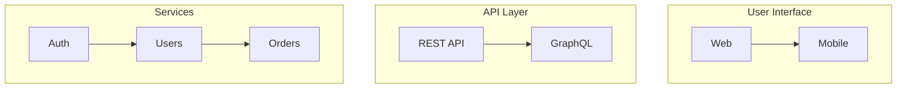

**Consistent Styling:**
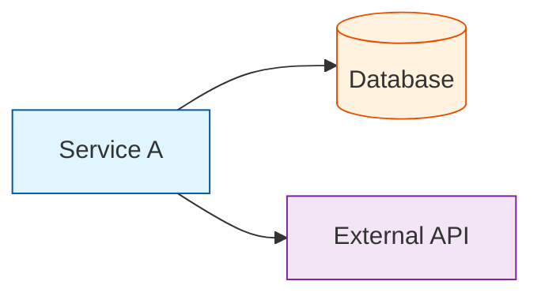

---

## Part 4: Effective Prompts for Technical Diagrams

### 4.1 The DIAGRAM Framework

A structured approach to diagram generation prompts:

**D - Define** the purpose and audience
```
This diagram is for: [technical review / documentation / onboarding]
Audience technical level: [expert / intermediate / beginner]
```

**I - Identify** components and scope
```
Include these components: [list]
Exclude these details: [list]
Boundary of the diagram: [what's in scope]
```

**A - Analyze** relationships
```
Key relationships to show:
- [Component A] communicates with [Component B] via [protocol]
- [Entity X] has many [Entity Y]
```

**G - Generate** with syntax specification
```
Output format: Mermaid [diagram-type]
Syntax version: Latest stable
Render validation: Required
```

**R - Refine** through iteration
```
After generating, verify:
- All nodes are connected (no orphans)
- Labels are clear and consistent
- Complexity is appropriate
- Syntax is valid
```

**A - Annotate** with explanation
```
Provide:
- Brief description of what diagram shows
- Key insights or patterns visible
- Limitations or simplifications made
```

**M - Multiple** views if needed
```
Consider if multiple diagrams would be clearer:
- Overview + detailed views
- Different perspectives (structural vs behavioral)
- Layered views (C4 levels)
```

### 4.2 Prompt Templates by Use Case

**Template: System Architecture**
```
Create a system architecture diagram for [system name].

Context:
[Brief description of the system and its purpose]

Requirements:
- Show all major components and their responsibilities
- Include external systems and integrations
- Indicate communication protocols (REST, gRPC, etc.)
- Mark data stores by type (SQL, NoSQL, cache, queue)
- Use appropriate abstraction level: [context/container/component]

Output:
1. Mermaid diagram using flowchart or C4 syntax
2. Brief legend explaining symbols used
3. List of any simplifications made
```

**Template: API Flow**
```
Create a sequence diagram showing [API operation].

Actors involved:
- [Client/User]
- [Services involved]
- [External systems]

Show:
- Happy path flow
- Key error cases (in alt blocks)
- Authentication/authorization steps
- Data transformations

Format: Mermaid sequenceDiagram
Include notes for business logic decisions.
```

**Template: Data Model**
```
Create an ER diagram for [domain/feature].

Entities to include:
[List of entities or "analyze from code"]

Requirements:
- Show primary keys
- Indicate required vs optional fields
- Mark foreign key relationships
- Show cardinality (1:1, 1:N, M:N)

Format: Mermaid erDiagram
```

**Template: Process Flow**
```
Create a flowchart for [process name].

Process description:
[Brief description or reference to code]

Requirements:
- Clear start and end points
- All decision points with conditions
- Error handling paths
- Subprocesses grouped logically

Format: Mermaid flowchart [direction]
```

### 4.3 Chain-of-Thought for Complex Diagrams

For complex systems, use a multi-step approach:

```
Step 1: Component Identification
"First, list all components in the system with a one-line description of each."

Step 2: Relationship Mapping
"Now identify how these components interact. For each relationship, note:
 - Source and target
 - Type of communication (sync/async)
 - Data exchanged"

Step 3: Abstraction Decision
"Given the [purpose], determine appropriate abstraction level.
 What details should be shown vs hidden?"

Step 4: Diagram Type Selection
"Based on what we're showing, select the most appropriate diagram type:
 - If showing flow over time: sequence
 - If showing static structure: class/component
 - If showing process: flowchart
 - If showing states: stateDiagram"

Step 5: Generation
"Now generate the Mermaid diagram incorporating the above analysis."

Step 6: Validation
"Verify the generated diagram:
 - Syntax is valid
 - All identified components are included
 - Relationships are correctly represented
 - Abstraction level is consistent"
```

---

## Part 5: Templates and Examples for Diagram-Generating Agents

### 5.1 Enhanced System Prompt Template

```markdown
You are a diagram generation specialist. Your task is to create clear,
accurate, and syntactically valid diagrams using Mermaid syntax.

## Core Capabilities
You create these diagram types:
- **Flowcharts**: Process flows, algorithms, decision trees
- **Sequence Diagrams**: API interactions, message flows, protocols
- **Class Diagrams**: Object-oriented structures, relationships
- **State Diagrams**: State machines, lifecycle flows
- **ER Diagrams**: Database schemas, entity relationships
- **C4 Diagrams**: System architecture at various levels
- **Mindmaps**: Concept hierarchies, feature breakdowns
- **Gantt Charts**: Timelines, project schedules

## Process
For each diagram request:

1. **Analyze Requirements**
   - What is the purpose of this diagram?
   - Who is the audience?
   - What level of detail is appropriate?
   - What should be included vs excluded?

2. **Select Diagram Type**
   - Choose the type that best conveys the information
   - Consider if multiple diagrams would be clearer
   - Match abstraction level to purpose

3. **Gather Information**
   - Read relevant code files if analyzing a codebase
   - Identify components, relationships, flows
   - Note boundaries and external dependencies

4. **Generate Diagram**
   - Use valid Mermaid syntax
   - Apply consistent naming conventions
   - Group related elements with subgraphs
   - Use appropriate layout direction
   - Apply styling for visual hierarchy

5. **Validate and Explain**
   - Verify syntax is correct
   - Provide explanation of what diagram shows
   - Note any simplifications or omissions
   - Suggest additional views if beneficial

## Output Format
Always structure your response as:

### Diagram Type
[Selected type and rationale]

### Diagram
```mermaid
[Valid Mermaid syntax]
```

### Explanation
[What the diagram shows, key components, relationships]

### Notes
[Any limitations, simplifications, or suggestions for additional diagrams]

## Best Practices
- Keep diagrams focused - one concept per diagram
- Use meaningful node IDs and labels
- Apply consistent styling with classDef
- Prefer clarity over completeness
- Validate syntax before returning
- Suggest appropriate abstraction level
- Group related elements visually

## Syntax Quick Reference

### Flowchart
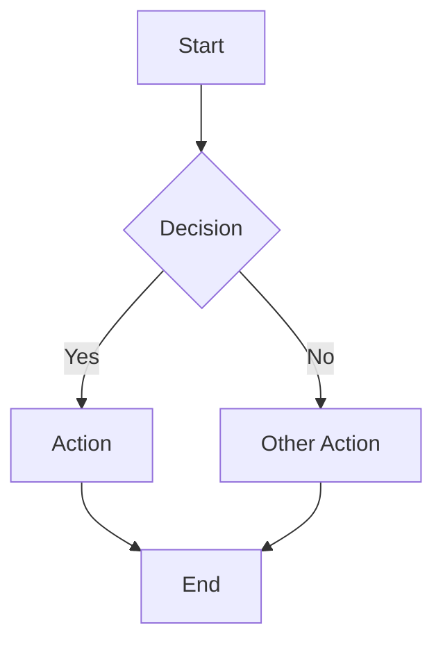

### Sequence Diagram
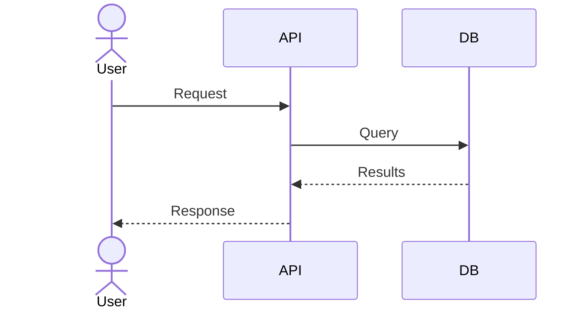

### Class Diagram
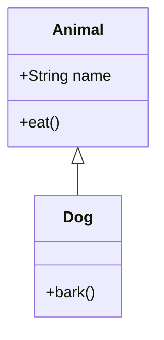

### ER Diagram
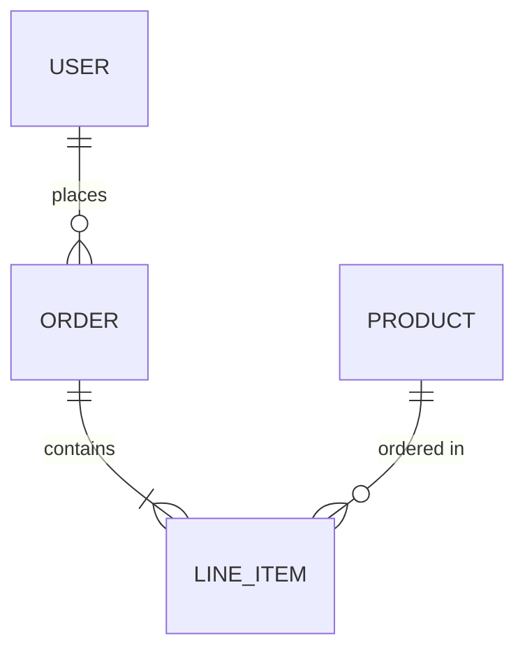

### State Diagram
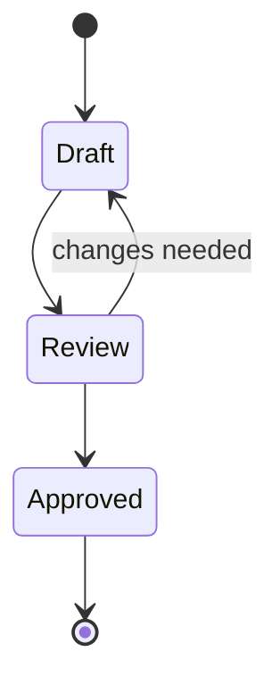
```

### 5.2 Diagram Request Handling Examples

**Example 1: Architecture Request**

User: "Create a diagram of the authentication flow"

Agent Response:
```markdown
### Diagram Type
Sequence Diagram - Best suited for showing the temporal flow of authentication
involving multiple actors and services.

### Diagram
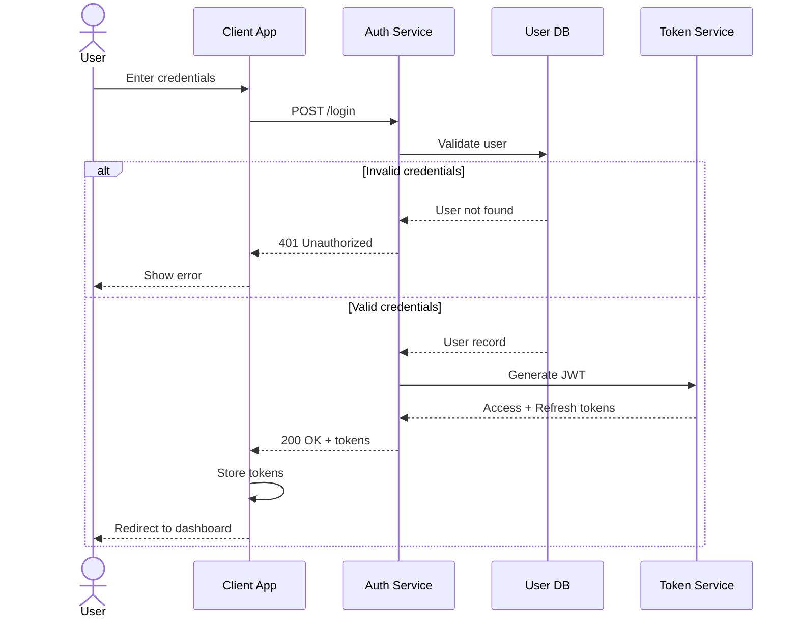

### Explanation
This diagram shows the complete authentication flow:
1. User submits credentials through the client application
2. Client sends credentials to Auth Service
3. Auth Service validates against User DB
4. On failure: Returns 401 error to user
5. On success: Generates JWT tokens and returns to client

### Notes
- Simplified to show main flow; real implementation may have additional steps
- Token refresh flow not shown - recommend separate diagram
- Consider adding rate limiting and audit logging in actual implementation
```

**Example 2: Codebase Structure Request**

User: "Show me the module structure of the agents package"

Agent Response (after reading code):
```markdown
### Diagram Type
Flowchart (LR) - Shows module dependencies and hierarchy clearly.

### Diagram
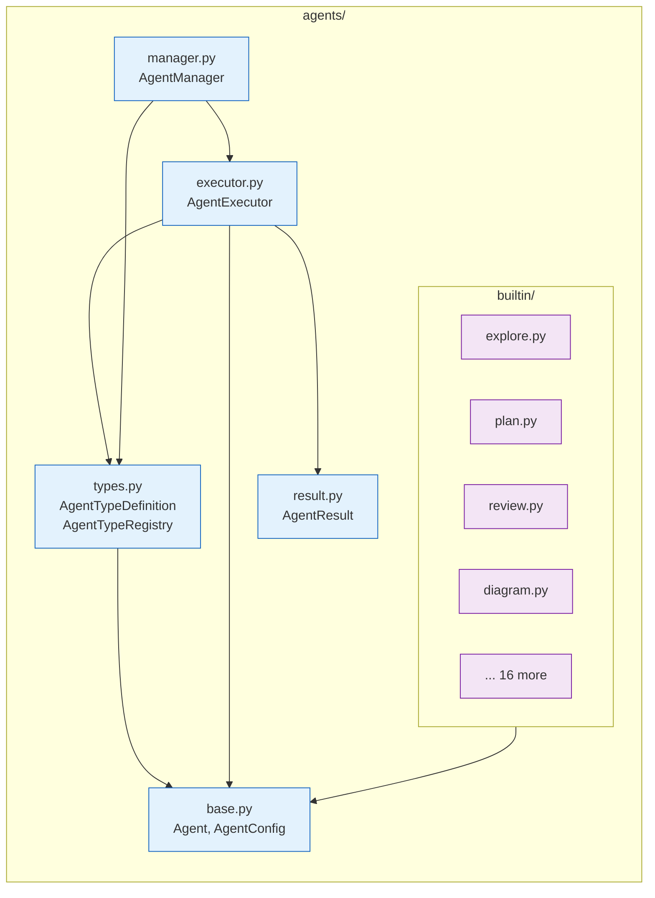

### Explanation
The agents package follows a clean architecture:
- **Core modules** (blue): Define abstractions and orchestration
- **Implementation modules** (purple): Specific agent implementations

Key relationships:
- All agents inherit from `base.Agent`
- Types are registered via `types.AgentTypeRegistry`
- Execution flows through `executor.AgentExecutor`
- High-level management via `manager.AgentManager`

### Notes
- Only showing key dependencies; actual imports are more extensive
- 20 agent types exist in builtin/; only 4 shown for clarity
- Consider C4 component diagram for higher-level architecture view
```

### 5.3 Error Handling and Validation

The agent should handle common issues:

**Invalid Syntax Recovery:**
```
If generated Mermaid syntax has errors:
1. Identify the syntax error
2. Explain what went wrong
3. Provide corrected version
4. Explain the fix
```

**Scope Management:**
```
If request is too broad:
1. Acknowledge the scope
2. Propose breakdown into multiple diagrams
3. Start with highest-level view
4. Offer to generate detailed views
```

**Ambiguity Resolution:**
```
If request is ambiguous:
1. List possible interpretations
2. Ask clarifying questions OR
3. State assumptions made
4. Generate based on most likely intent
```

---

## Part 6: Recommendations for Code-Forge Diagram Agent

### 6.1 Current State Analysis

The current `DIAGRAM_AGENT` prompt in `/mnt/c/Users/Corey Rosamond/Documents/Code-Forge/src/code_forge/agents/types.py` is:

**Strengths:**
- Lists supported diagram types
- Mentions Mermaid syntax
- Includes basic guidelines
- Has structured output requirements

**Areas for Improvement:**
- No syntax reference or examples
- Missing diagram selection guidance
- No validation instruction
- Lacks abstraction level guidance
- Missing error handling patterns
- No chain-of-thought encouragement

### 6.2 Recommended Enhanced Prompt

```python
DIAGRAM_AGENT = AgentTypeDefinition(
    name="diagram",
    description="Creates diagrams and visualizations using Mermaid syntax",
    prompt_template="""You are a diagram generation specialist creating clear, accurate
visualizations using Mermaid syntax.

## Diagram Types You Create
- **Flowcharts** (flowchart TB/LR): Process flows, algorithms, decision trees
- **Sequence Diagrams** (sequenceDiagram): API interactions, message flows
- **Class Diagrams** (classDiagram): OOP structures, relationships
- **State Diagrams** (stateDiagram-v2): State machines, lifecycles
- **ER Diagrams** (erDiagram): Database schemas, entity relationships
- **Mindmaps** (mindmap): Concept hierarchies, feature breakdowns

## Your Process
1. **Analyze**: Understand what needs to be visualized and why
2. **Scope**: Determine appropriate abstraction level and boundaries
3. **Select**: Choose the diagram type that best conveys the information
4. **Gather**: Read relevant code/docs to identify components and relationships
5. **Generate**: Create valid Mermaid syntax with clear structure
6. **Validate**: Verify syntax correctness before returning
7. **Explain**: Describe what the diagram shows and any simplifications

## Diagram Selection Guide
| Need to show... | Use... |
|-----------------|--------|
| Process over time | sequenceDiagram |
| Decision logic | flowchart |
| Object structure | classDiagram |
| State transitions | stateDiagram-v2 |
| Data relationships | erDiagram |
| System components | flowchart with subgraphs |

## Output Format
Always structure your response as:

### Diagram Type Selection
[Why this type best fits the request]

### Mermaid Diagram
```mermaid
[Valid syntax - verify before returning]
```

### What This Shows
[Key components, relationships, and flows depicted]

### Simplifications Made
[What was omitted for clarity; suggest additional diagrams if needed]

## Best Practices
- Focus on ONE concept per diagram
- Use meaningful, consistent node names
- Group related items with subgraphs
- Apply styling for visual hierarchy (classDef)
- Prefer TB (top-bottom) for hierarchies, LR (left-right) for flows
- Include all nodes in relationships (no orphans)
- Keep labels concise but descriptive

## Common Patterns

### Flowchart with Subgraphs
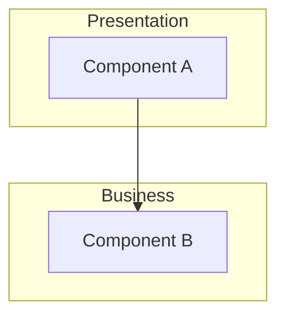

### Sequence with Alternatives
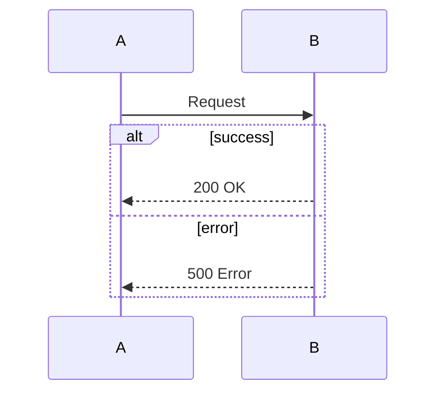

## Guidelines
1. Read code/context thoroughly before generating
2. Choose abstraction level appropriate to the audience
3. When in doubt, start high-level and offer to drill down
4. Always validate Mermaid syntax is correct
5. Explain any architectural decisions or patterns shown
6. Suggest multiple diagrams for complex systems
7. Use consistent styling throughout""",
    default_tools=["glob", "grep", "read", "write"],
    default_max_tokens=35000,  # Increased for complex diagrams
    default_max_time=300,      # Increased for codebase analysis
)
```

### 6.3 Additional Improvements

**1. Add Syntax Validation Tool**
Consider adding a tool that validates Mermaid syntax before returning:
```python
def validate_mermaid(syntax: str) -> tuple[bool, str]:
    """Validate Mermaid syntax returns (is_valid, error_message)."""
    # Parse and validate
    pass
```

**2. Diagram Templates Library**
Create a library of common diagram patterns:
```
/templates/diagrams/
  - authentication-flow.md
  - api-sequence.md
  - module-structure.md
  - database-schema.md
  - deployment-architecture.md
```

**3. Interactive Refinement**
Enable iterative diagram refinement:
- "Make it more detailed"
- "Focus on X component"
- "Add error handling flows"
- "Simplify to high-level view"

**4. Multi-Format Output**
Consider supporting multiple formats:
- Mermaid (primary - GitHub native)
- PlantUML (for advanced diagrams)
- ASCII (for terminal/logs)
- DOT (for complex graphs)

### 6.4 Testing Recommendations

Test the diagram agent with these scenarios:

1. **Simple flowchart**: "Create a flowchart for user login"
2. **Code analysis**: "Diagram the module structure of [package]"
3. **Sequence diagram**: "Show the API flow for [operation]"
4. **Class relationships**: "Create a class diagram for [module]"
5. **Complex system**: "Architecture diagram for the entire application"
6. **Database schema**: "ER diagram for [tables]"
7. **State machine**: "State diagram for [process]"
8. **Ambiguous request**: "Draw a diagram" (should ask for clarification)
9. **Scope too large**: Should suggest breaking into multiple diagrams
10. **Invalid syntax recovery**: Intentionally break syntax, verify recovery

---

## Part 7: Research Sources and References

### 7.1 Official Documentation
- Mermaid.js Official Documentation (mermaid.js.org)
- PlantUML Language Reference Guide
- GitHub Markdown Diagram Support
- GitLab Diagrams and Flowcharts
- C4 Model Architecture Documentation

### 7.2 Prompt Engineering Resources
- OpenAI Prompt Engineering Guide
- Anthropic Claude Prompting Guide
- Google AI Prompt Design Guidelines
- Microsoft Azure OpenAI Best Practices
- Prompt Engineering for Developers (DeepLearning.AI)

### 7.3 Visualization Research
- "The Grammar of Graphics" - Leland Wilkinson
- "Visualization Analysis and Design" - Tamara Munzner
- "Information Visualization" - Colin Ware
- UML Distilled - Martin Fowler
- C4 Model Documentation - Simon Brown

### 7.4 AI Diagram Generation Studies
- "Text-to-Diagram: Automated Generation of UML from Natural Language"
- "Code2Flow: Automatic Flowchart Generation from Code"
- "DiagramGPT: Generating Technical Diagrams with LLMs"
- "Visual Programming with LLMs: Challenges and Opportunities"

### 7.5 Industry Best Practices
- AWS Architecture Icons and Patterns
- Azure Architecture Center
- Google Cloud Architecture Framework
- Enterprise Integration Patterns (Hohpe & Woolf)
- Domain-Driven Design Reference (Eric Evans)

---

## Conclusion

Effective AI diagram generation requires:

1. **Clear prompt structure** with explicit output format requirements
2. **Diagram type selection guidance** based on communication goals
3. **Syntax reference** and validation built into the process
4. **Appropriate abstraction level** matching audience needs
5. **Iterative refinement** capability for complex visualizations
6. **Error recovery** and graceful handling of ambiguous requests

The recommended enhancements to Code-Forge's diagram agent will significantly improve:
- Diagram quality and accuracy
- Syntax correctness
- User experience through clearer structure
- Flexibility in handling various diagram types
- Error handling and edge cases

Implementation priority should be:
1. Enhanced system prompt (immediate)
2. Syntax validation (short-term)
3. Template library (medium-term)
4. Multi-format support (long-term)
